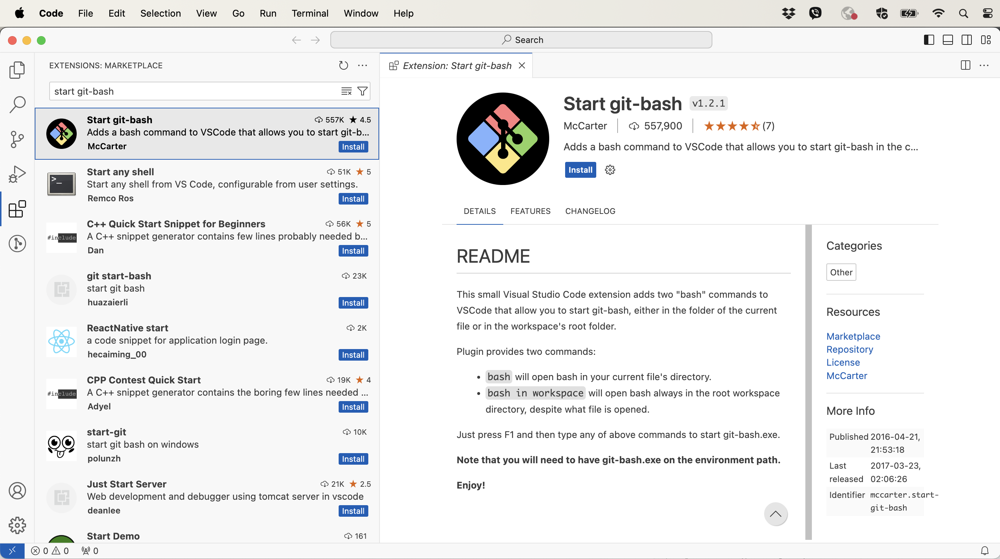
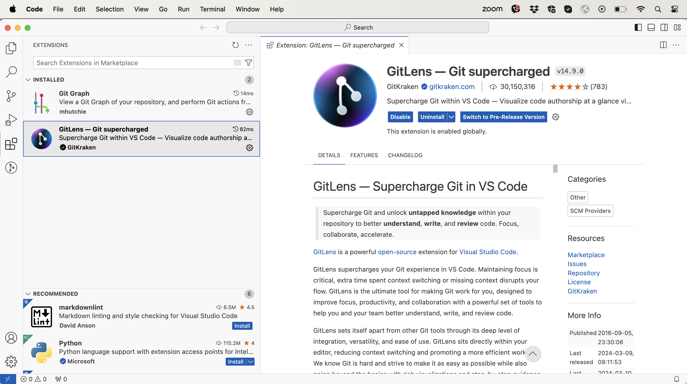
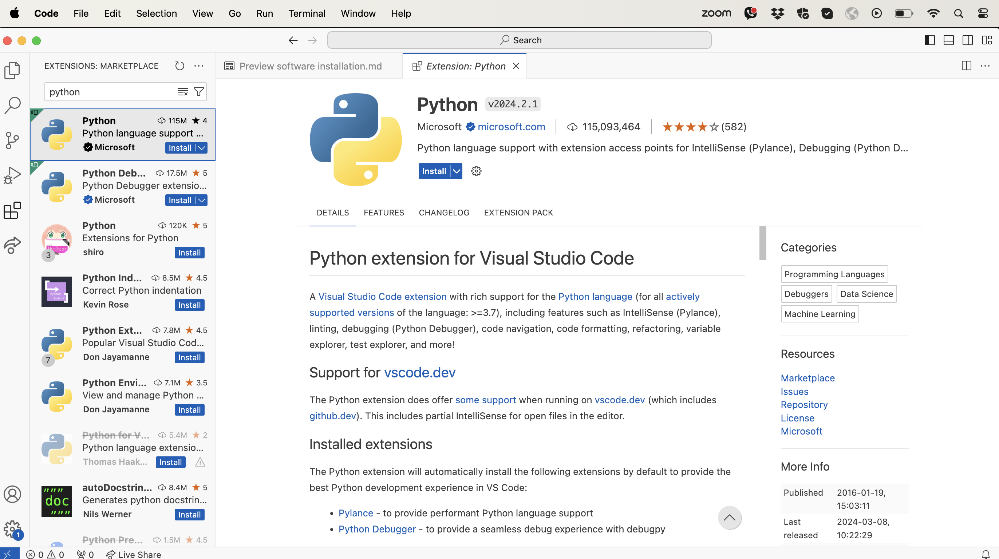
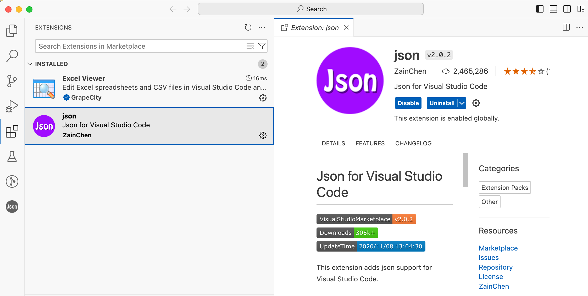
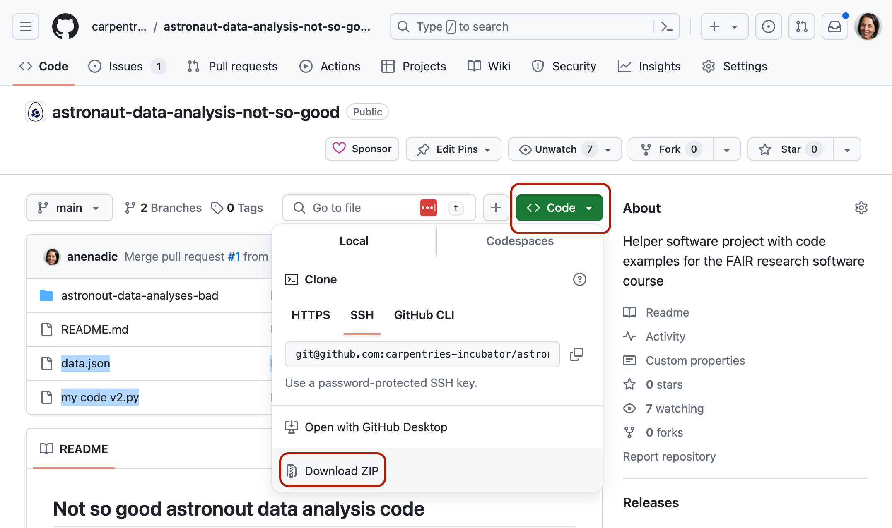

## Setup

To go through the course material on your own or at a workshop, 
you will need the following software installed and working correctly on your system:

- [Command line tool](index.html#command-line-tool) (such as **Bash**, **Zsh** or **Git Bash**)  
- [Git version control program](index.html#git-version-control-program)
- [GitHub account](index.html#github-account)
- [Python 3](index.html#python-3-distribution)
- [Visual Studio Code (VS Code)](index.html#visual-studio-code-vs-code) integrated development environment (IDE)
- [Astronaut data and analysis code](index.html#astronaut-data-and-analysis-code) which we will be used for exercises in the course

The installation instructions for these tools are below.


### Command Line Terminal
You will need a command line terminal (also referred to as a shell) 
in order to run Python scripts and various command like tools (such as Git and tools that interact with your filesystem).

#### Windows 

Windows users *will have to* install **Git Bash** 
(which is included in [Git For Windows package](https://gitforwindows.org/)).
This will install the Bash command line terminal emulation and Git command line tool together 
(which will behave in the same way as in Linux environments).

Note that the use of Windows command line terminals **Powershell** or `cmd` is not suitable for the course. 
We also advise against using [Windows Subsystem for Linux (WSL)](https://learn.microsoft.com/en-us/windows/wsl/) 
for this course as we do not provide instructions for troubleshooting any potential issues between WSL and 
Visual Studio Code (VS Code).

The Git Bash installation presents the user with lots of configuration options - we recommend changing the following 
two and accepting the default values for all of the others:

- "Git Editor" option for Git Bash - by default this is set to **Vim**; make sure to select **VS Code** instead -  
if that option is available to you - otherwise accept the default option and we will help you change that later on;
- "Adjusting the name of the initial branch in new repositories" option - by default this is set to "Let Git decide"; 
make sure to select the "Override the default branch name for new repositories" option and 
type the name "main" in the text field.


#### macOS and Linux 

MacOS and Linux users will already have a command line terminal available on their systems. 
You can use a command line terminal such as [Bash](https://www.gnu.org/software/bash/),
or any other [command line terminal that has similar syntax to Bash](https://en.wikipedia.org/wiki/Comparison_of_command_shells),
since none of the content of this course is specific to Bash. Note that starting with macOS Catalina,
Macs will use [Zsh (Z shell)](https://www.zsh.org/) as the default command line terminal instead of Bash.

#### Testing Command Line Terminal

To test your command line terminal, start it up and type:

```bash
$ date
```

If your command line terminal is working - it should return the current date and time similar to:

```output
Wed 21 Apr 2021 11:38:19 BST
```

### Git Version Control Program

Git is a command line program that is run from within a command line terminal to provide version control for your work. 
Git is also used to interact with online code and project sharing platform GitHub.

Follow the installation instructions below, then proceed to test and configure Git on your machine in 
additional steps.

#### Windows

Windows users *will have to* use **Git Bash** - as explained in the 
[command line terminal installation section](index.html#command-line-tool).

#### macOS and Linux

On macOS, Git is included as part of Apple's [Xcode tools](https://en.wikipedia.org/wiki/Xcode)
and should be available from the command line as long as you have Xcode. If you do not have Xcode installed, you can download it from
[Apple's App Store](https://apps.apple.com/us/app/xcode/id497799835?mt=12) or you can
  [install Git using alternative methods](https://git-scm.com/download/mac).

On Linux, Git can be installed using your favourite package manager.

#### Testing Git

To test your Git installation, start your command line terminal and type:

```bash
$ git help
```

If your Git installation is working you should see something like:

```output
usage: git [-v | --version] [-h | --help] [-C <path>] [-c <name>=<value>]
           [--exec-path[=<path>]] [--html-path] [--man-path] [--info-path]
           [-p | --paginate | -P | --no-pager] [--no-replace-objects] [--bare]
           [--git-dir=<path>] [--work-tree=<path>] [--namespace=<name>]
           [--config-env=<name>=<envvar>] <command> [<args>]

These are common Git commands used in various situations:

start a working area (see also: git help tutorial)
   clone     Clone a repository into a new directory
   init      Create an empty Git repository or reinitialize an existing one

work on the current change (see also: git help everyday)
   add       Add file contents to the index
   mv        Move or rename a file, a directory, or a symlink
   restore   Restore working tree files
   rm        Remove files from the working tree and from the index

examine the history and state (see also: git help revisions)
   bisect    Use binary search to find the commit that introduced a bug
   diff      Show changes between commits, commit and working tree, etc
   grep      Print lines matching a pattern
   log       Show commit logs
   show      Show various types of objects
   status    Show the working tree status

grow, mark and tweak your common history
   branch    List, create, or delete branches
   commit    Record changes to the repository
   merge     Join two or more development histories together
   rebase    Reapply commits on top of another base tip
   reset     Reset current HEAD to the specified state
   switch    Switch branches
   tag       Create, list, delete or verify a tag object signed with GPG

collaborate (see also: git help workflows)
   fetch     Download objects and refs from another repository
   pull      Fetch from and integrate with another repository or a local branch
   push      Update remote refs along with associated objects

'git help -a' and 'git help -g' list available subcommands and some
concept guides. See 'git help <command>' or 'git help <concept>'
to read about a specific subcommand or concept.
See 'git help git' for an overview of the system.
```

#### Configuring Git
When you use Git on a machine for the first time, you also need to configure a few additional things:

* your name,
* your email address (the one you used to open [your GitHub account](../index.html#github-account) with, 
which will be used to identify your commits),
* preferred text editor for Git to use (e.g. **Nano** or another text editor of your choice),
* whether you want to use these settings globally (i.e. for every Git project on your machine).

This can be done from a command line terminal as follows:

```bash
$ git config --global user.name "Your Name"
$ git config --global user.email "name@example.com"
$ git config --global core.editor "nano -w"
```

### GitHub Account

GitHub is a free, online host for Git repositories that you will use during the course to store your work in so
you will need to open a free [GitHub](https://github.com/) account unless you do not already have one.

#### Configuring GitHub Account

In order to access GitHub using Git from your machine securely,
you need to set up a way of authenticating yourself with GitHub through Git.
The recommended way to do that for this course is to set up
[**SSH authentication**](https://www.ssh.com/academy/ssh/public-key-authentication) which requires a pair of keys -
one public that you upload to your GitHub account, and one private that remains on your machine.

GitHub provides full documentation and guides on how to:

- [generate an SSH key](https://docs.github.com/en/authentication/connecting-to-github-with-ssh/generating-a-new-ssh-key-and-adding-it-to-the-ssh-agent), and
- [add an SSH key to a GitHub account](https://docs.github.com/en/authentication/connecting-to-github-with-ssh/adding-a-new-ssh-key-to-your-github-account).

A short summary of the commands you need to perform is shown below.

To generate an SSH key pair, you will need to run the `ssh-keygen` command line tool (included with your command line 
terminal) and provide **your identity for the key pair** (e.g. the email address you used to register with GitHub)
via the `-C` parameter as shown below.

You will then be prompted to answer a few questions -
e.g. where to save the keys on your machine and a passphrase to use to protect your private key.
Pressing 'Enter' on these prompts will get `ssh-keygen` to use the default key location (within
`.ssh` folder in your home directory) and set the passphrase to empty.

```bash
$ ssh-keygen -t ed25519 -C "your-github-email@example.com"
```

```output
Generating public/private ed25519 key pair.
Enter file in which to save the key (/Users/<YOUR_USERNAME>/.ssh/id_ed25519): 
Enter passphrase (empty for no passphrase): 
Enter same passphrase again: 
Your identification has been saved in /Users/<YOUR_USERNAME>/.ssh/id_ed25519
Your public key has been saved in /Users/<YOUR_USERNAME>/.ssh/id_ed25519.pub
The key fingerprint is:
SHA256:qjhN/iO42nnYmlpink2UTzaJpP8084yx6L2iQkVKdHk your-github-email@example.com
The key's randomart image is:
+--[ED25519 256]--+
|.. ..            |
| ..o A           |
|. o..            |
| .o.o .          |
| ..+ =  B        |
| .o = ..         |
|o..X *.          |
|++B=@.X          |
|+*XOoOo+         |
+----[SHA256]-----+
```

Next, you need to copy your public key (**not your private key - this is important!**) over to
your GitHub account. The `ssh-keygen` command above will let you know where your public key is saved
(the file should have the extension ".pub"), and you can get its contents from a command line terminal as follows:

```bash
$ cat /Users/<YOUR_USERNAME>/.ssh/id_ed25519.pub
```
```output
ssh-ed25519 AABAC3NzaC1lZDI1NTE5AAAAICWGVRsl/pZsxx85QHLwSgJWyfMB1L8RCkEvYNkP4mZC your-github-email@example.com
```

Copy the line of output that starts with "ssh-ed25519" and ends with your email address
(it may start with a different algorithm name based on which one you used to generate the key pair
and it may have gone over multiple lines if your command line terminal window is not wide enough).

Finally, go to your [GitHub Settings -> SSH and GPG keys -> Add New](https://github.com/settings/ssh/new) page
to add a new SSH public key.
Give your key a memorable name (e.g. the name of the computer you are working on that contains the
private key counterpart), paste the public key
from your clipboard into the box labelled "Key" (making sure it does not contain any line breaks),
then click the "Add SSH key" button.

To test if you can successfully authenticate to GitHub using your new key pair, do:

```bash
$ ssh -T git@github.com
```

You may be asked to add GitHub to the list of trusted hosts on your machine (say 'yes' to that) and then you should see a line similar to:

```output
Hi anenadic! You've successfully authenticated, but GitHub does not provide shell access.
```

### Python 3 Distribution

You will need Python 3 for this course (note that while Python 2 may work as well, it is not supported by this course). 
You may already have Python 3 installed on your system, in which case you do not have to do anything.

To download the latest Python distribution for your operating system,
please head to [Python.org](https://www.python.org/downloads/). 
Then use an appropriate command for your platform (see below) to test your installation.

Windows users should make sure to tick the "Add python.exe to PATH" check box at the bottom of the first page of the installer wizard to make sure that Python executable is found after installation.

#### Testing Python 3

You can check that you have Python 3 installed correctly from the command line terminal using the command below.

```bash
$ python3 --version # on macOS/Linux
$ python --version # on Windows — Windows installation comes with a python.exe file rather than a python3.exe file 
```

You should see something like the output below.

```output
Python 3.11.7
```

::: callout

If you are using Windows and invoking `python` command causes your Git Bash terminal to hang with no error message 
or output, you may need to create an alias for the Python executable `python.exe` like so:

```bash
$ alias python="winpty python.exe"
```
This alias will be valid for the duration of the shell session. For a more permanent solution, from the shell do:

```bash
$ echo "alias python='winpty python.exe'" >> ~/.bashrc
```
:::


### Visual Studio Code (VS Code)
We will use Microsoft [Visual Studio Code (VS Code)](https://code.visualstudio.com/) as an
Integrated Development Environment (IDE) to type and execute Python code and run command line terminal and Git commands
(through its integrations with the tools we have installed separately so far).

Please make sure to [download VS Code](https://code.visualstudio.com/Download) for your platform.

#### Command Line Terminal & Git Integration in VS Code

On macOS and Linux systems, VS Code will typically recognise a command line terminal you already have on your system
(along with all programs/commands such as Git you can run from it) and you will not need to do anything and 
it will be available as a "Terminal" in VS Code.

On Windows, if VS Code does not automatically recognise Git Bash as a command line terminal to be used as a "Terminal", 
installing VS Code extension "Start git-bash" should help (to view available and installed extensions, 
go to `View > Extensions` from the top-level menu).

{ alt-text="Git Bash extension for VS Code on Windows" .image-with-shadow }

To check the command line integration and that VS Code knows about different command line terminal(s) installed 
on your system select "Terminal -> New Terminal" from the top level menu.
This should open a terminal window within VS Code. Within the terminal window, the type of the current terminal is 
indicated towards the right of the window (e.g. in the image below, the current command line terminal is `bash` - but 
note that you may have different terminal types installed on your machine). 
This can be changed (provided you have several command line terminal programmes installed on your machine) 
by clicking the "+" drop-down menu button next to the command line terminal indicator. Windows users may have 
"Powershell" selected by default here - you should select "Git Bash" from the list.

You can also change the default command line terminal from the same drop down menu by using the option 
"Select Default Profile" (so it will use that one next time you open a terminal window).

{alt='Terminal window in VS Code with "Select Default Profile" option highlighted'}

#### VS Code Extentions for Git 

You could also install the following VS Code extensions (from `View > Extensions` top-level menu) 
to make your Git experience in VS Code better:

- GitLense - Git Supercharged (adds a few nice additions to Git support in VS Code)
- Git Graph (provides nice graphs and visualisations of a Git repository in VS Code)

{ alt-text="GitLens and Git Graph extensions for VS Code" .image-with-shadow }

#### Python Integration in VS Code

If you open an existing Python file or create a new blank one (with extension ".py") from VS Code - 
it should recognise it as a Python file already.
VS Code may ask you to select a Python interpreter if you try to run the file, at which point you should select the 
Python 3 you installed.

#### VS Code Extensions for Python

You should also install the Python extension for VS Code by Microsoft (from `View > Extensions` top-level menu) 
to make your Python experience in VS Code better.

{ alt-text="Python extension for VS Code by Microsoft" .image-with-shadow }


#### VS Code Extentions for Viewing Data

You should install the following extensions for viewing and editing data in VS Code:

- Excel Viewer - custom editor and previewer for CSV files and Excel spreadsheets 
- JSON - custom editor and previewer for JSON files

{ alt-text="CSV and JSON data editor and viewer extensions for VS Code" .image-with-shadow }


### Astronaut data and analysis code 

Download the data and code from the 
[software repository](https://github.com/carpentries-incubator/astronaut-data-analysis-not-so-good) by clicking the
green `<> Code` button, then selecting `Download ZIP` option from the drop-down menu.

{ alt-text="Code download as a zip file from GitHub" .image-with-shadow }

This repository contains [NASA's open data on spacewalks](https://data.nasa.gov/Raw-Data/Extra-vehicular-Activity-EVA-US-and-Russia/9kcy-zwvn/data_preview) 
(i.e. extravehicular activities - EVAs) undertaken by astronauts and cosmonauts from 1965 to 2013
and some Python code to analyse and plot this data. 
We will use it for code examples and exercises throughout this course.
